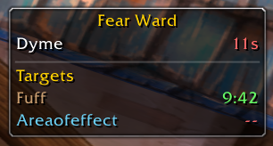
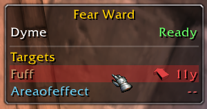
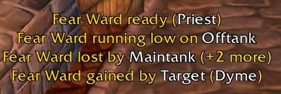
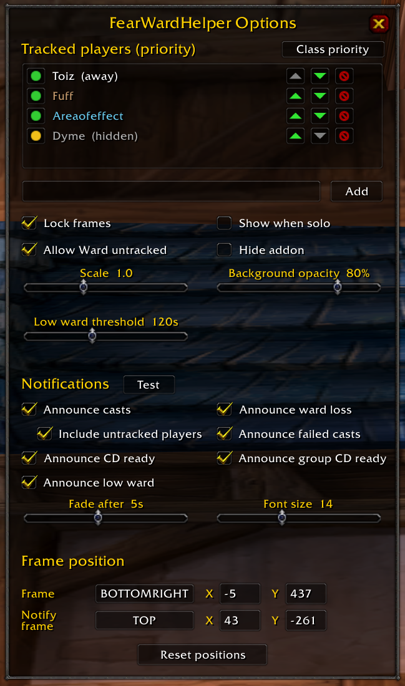
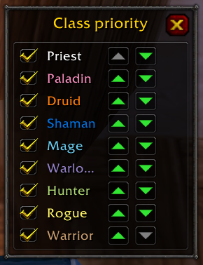

# FearWardHelper

A Fear Ward manager for the **World of Warcraft 1.12 client** (private "Turtle-style"
servers — built and tested against OctoWoW). Fear Ward (spell `6346`) is an instant,
30-second-cooldown Priest buff that blocks the next fear for 10 minutes — the single
most important cooldown to keep rolling on your tanks in fights like Onyxia,
Broodlord, or any AoE-fear pull. FearWardHelper answers the four questions that
otherwise get shouted over voice comms all night:

1. **Whose Fear Ward is up?** — a cooldown tracker listing every priest in your
   party/raid, green **Ready** or a red countdown, so you always know who can ward
   *right now*.
2. **Who still needs warding?** — a watch-list of the players you care about (tanks,
   off-tanks, key targets) showing whether each currently has the buff and how much
   time is left.
3. **Ward them without losing your target** — click a watched player's row (or bind a
   macro) to cast Fear Ward on them without dropping whatever you're currently
   targeting, with live range/line-of-sight feedback and a direction arrow.
4. **Announce what's happening** — a floating notification area that calls out casts,
   losses (batched for AoE fears), wards running low, and cooldowns coming back up.

Cooldown and ward tracking work for **any class** — a raid leader who isn't a Priest
can run FearWardHelper purely to watch the priests. The cast helper only lights up
for a Priest who actually knows Fear Ward; everyone else sees the trackers in a
read-only "observer" mode.

> **Status:** implemented and in active use, but not yet exercised across every code
> path in a full raid — treat it as a beta. See [CLAUDE.md](CLAUDE.md)'s "Open
> TODOs" for what polish is left.

---

## Contents

- [Environment & compatibility](#environment--compatibility)
- [Installation](#installation)
- [Quick start](#quick-start)
- [The tracker frame](#the-tracker-frame)
- [The watch-list & casting](#the-watch-list--casting)
  - [Watch states: shown / hidden / off](#watch-states-shown--hidden--off)
  - [Casting on a watched player](#casting-on-a-watched-player)
  - [WardNext: the priority engine](#wardnext-the-priority-engine)
- [Notifications](#notifications)
- [The config panel](#the-config-panel)
  - [Class priority](#class-priority)
- [Slash commands](#slash-commands)
- [Macro globals](#macro-globals)
- [Tips & known limitations](#tips--known-limitations)
- [Development](#development)
- [License](#license)

---

## Environment & compatibility

FearWardHelper targets the **1.12.1 client**. It works standalone, but it *detects* a
few optional client patches and addons at login and unlocks extra precision when
they're present:

| Optional | What it unlocks | Without it |
| --- | --- | --- |
| **SuperWoW** (client-side patch) | The core of the addon: observing *every* priest's Fear Ward casts (`UNIT_CASTEVENT`), the event-driven ward buff signal (`BUFF_ADDED`/`BUFF_REMOVED`), GUID-based unit resolution, and `UnitPosition` for the hover distance/arrow. | Frames and the cast helper still work, ward *presence* is polled via base-API `UnitBuff`, and cooldowns still arrive over sync from other FearWardHelper users — but your own cooldown won't self-populate after casting, and others' wards are only seen in buff-scan range. A one-time warning prints. |
| **Nampower** (client-side patch) | `CastSpellByName(name, unit)` casts Fear Ward directly on a unit without touching your target. | Falls back to the `AutoSelfCast`-off + `SpellTargetUnit` dance — same result, slightly more work under the hood. |
| **UnitXP_SP3** (addon) | Exact range (`distanceBetween`) and line-of-sight (`inSight`) for the watch-row hover: the yards-to-close countdown, the `LOS` indicator, and the WardNext reachability gate. | Falls back to a coarse `CheckInteractDistance` range gate (~28y) with no LOS test — the hover still shows range, just less precisely, and never flags `LOS`. |

Two FearWardHelper users in the same raid also **sync** their own casts to each other
over addon messages, so a priest you can't even see still shows the right cooldown.
None of the above is required, and nothing needs configuring — detection is automatic
and silent.

The other local addons referenced while *building* FearWardHelper (idioms borrowed —
distinct from the runtime detection above) are documented in [CLAUDE.md](CLAUDE.md)'s
"Reference addons" section; none need to be installed to run it.

## Installation

1. Download or clone this repository.
2. Copy the whole folder into your WoW installation's `Interface/AddOns/` directory so
   the path reads `Interface/AddOns/FearWardHelper/FearWardHelper.toc`.
3. Launch the game and enable **FearWardHelper** on the AddOns screen at character
   select if it isn't already ticked.

A tagged release also builds a ready-to-extract `FearWardHelper.zip` via CI
(`pack.ps1`) — grab that from the repository's Releases page if you'd rather not clone.

## Quick start

1. Get into a group with at least one Priest. FearWardHelper only shows itself while
   grouped (or set `showWhenSolo`) **and** a priest is present — no priest means no
   Fear Ward to track, so it stays hidden.
2. Open the config panel with **`/fw`**.
3. Add the players you want to keep warded to the **watch-list** — type a name into the
   add box. Order them by priority with the ^/v buttons (top = most important — your
   main tank).
4. In the raid, glance at the frame: the top section is every priest's Fear Ward
   cooldown, the bottom section is your watch-list and who's warded.
5. If you're a Priest, **left-click a watched player's row to ward them** — no target
   switch. Or bind `FearWardHelper_WardNext()` to a key and just mash it: it always
   wards the highest-priority player who needs it (see [WardNext](#wardnext-the-priority-engine)).



## The tracker frame

FearWardHelper draws a single moveable panel (`FearWardHelper_CD`) that stacks two
lists:

- **Cooldowns** (top) — one row per priest in the group, showing **Ready** (green) or a
  red 30-second countdown. Names are class-coloured.
- **Targets** (below a divider + "Targets" sub-header) — one row per *shown* watched
  player who is present in the group, showing whether they have Fear Ward and the time
  left. Green = warded with plenty of time, orange = warded but under your low-duration
  threshold, red = not warded.

The target section only appears when at least one watched player is actually present.
Drag the frame to move it while unlocked, and resize its **width** from the bottom-right
grip (height is driven by the row count). `/fw lock` / `/fw unlock` toggles dragging;
scale, background opacity, and everything else is in the config panel (`/fw`). (See the
[hero shot](#fearwardhelper) above for the frame in a live raid.)

## The watch-list & casting

### Watch states: shown / hidden / off

Every watch-list entry keeps its priority slot but sits in one of three states — a
linear "level of involvement":

- **shown** — tracked, drawn as a row, a WardNext priority, and notified about.
- **hidden** — still a WardNext priority and still notified, but **no visible row**. For
  a background target you want topped off but not staring at (an off-tank).
- **off** — kept in the list but not a tracked priority: no row, no priority slot, no
  notifications. For someone not tanking tonight but back next raid, so you don't
  remove and re-add them. Still **sweep-eligible** (see below) — off means "don't
  prioritize", not "never ward".

In the config panel each row has a tri-state button (`S`/`H`/`O`) that cycles
shown → hidden → off.

### Casting on a watched player

If you're a Priest who knows Fear Ward, the watch rows are a **cast helper**: click one
to cast Fear Ward on that player **without switching your target**. (For everyone else
the rows are inert — no error spam, no highlight.)

When you hover a castable row, it shows you whether you can actually reach the target:

- **Out of range** — the status column counts down the **yards still to close** (red)
  and a **direction arrow** points the way to run.
- **No line of sight** (`LOS`) — in range but sight-blocked: shows `LOS` and the arrow
  still points the way so you can reposition.
- **Castable** — a plain grey hover tint, no arrow.

Clicking a row that's already safely warded is refused with a chat line
("`<name> already has Fear Ward (M:SS left)`") rather than wasting the spell and its
30s cooldown topping off a full ward — a recast is only allowed when they're unwarded or
under your low-duration threshold.



### WardNext: the priority engine

The real workhorse is `FearWardHelper_WardNext()` — bind it to a key. It wards the
**next** player who needs one, in three priority tiers:

1. **Shown tracked** — your visible watch-list, in order. The top present + unwarded
   entry is authoritative: if reachable it gets warded; if unreachable the cast is
   **blocked** (and optionally announced) rather than silently dropping to someone
   lower — you want to know your main tank is out of range, not quietly ward the
   off-tank instead.
2. **Hidden tracked** — hidden watch entries, in priority order; the first present,
   unwarded, *reachable* one is warded. Unreachable ones are skipped (a preference, not
   a gate).
3. **Sweep** (optional — the **Allow Ward untracked** checkbox) — anyone else present
   who isn't already an enabled priority: untracked group members *and* `off` watch
   entries. Candidates are taken **by class** in a configurable class-priority order
   (see [Class priority](#class-priority)), then roster order within a class.

A ward "needs" (re)applying when the target is unwarded *or* under your low-duration
threshold, so WardNext tops off a soon-to-expire ward early rather than waiting for it
to drop. `FearWardHelper_WardNextTracked()` is the same thing but **only tiers 1 & 2** —
it never sweeps, for a "top off my watch-list only" keybind.

## Notifications

A floating, fading message area (`FearWardHelper_Notify`) that announces time-sensitive
Fear Ward events. Each kind has its own on/off toggle; all share one look, stack
newest-first, and fade out after a configurable delay. The area is moveable and
anchorable like the trackers (its "size" is the font size — there's no resize grip),
and it aligns/grows from whichever corner you anchor it to.

Announced events:

- **Cast** — "`Fear Ward gained by <target> (<caster>)`" when a ward lands.
- **Loss** — "`Fear Ward lost by <name>`", batched (with a "`(+N more)`" suffix) so an
  AoE fear that eats five wards at once is one line, not five. A ward that simply
  **expired** is reported separately ("`Fear Ward expired on <name>`").
- **Low ward** — "`Fear Ward running low on <name>`" once a ward drops below your
  low-duration threshold.
- **CD ready** — "`Fear Ward ready`" when your own cooldown comes back, and
  optionally "`Fear Ward ready (<priest>)`" for other group priests.
- **Blocked cast** — "`Fear Ward blocked: <name> (out of range / no line of sight)`"
  when WardNext's top target is unreachable.

By default notifications are only raised about players actually in your raid/party;
"Include untracked group members" widens casts and losses to in-group players who
aren't on your watch-list.



## The config panel

`/fw` (or `/fw config`) opens a hand-built panel (drag the title bar to move it) —
**this is where nearly everything is configured**. It's a front-end over the same
internal setters, so the panel and live dragging never disagree.



It contains:

- **The watch-list editor** — a scrollable list (5 rows visible) with, per row, the
  tri-state **S/H/O** button, up/down reorder arrows, and an **X** to remove. A **Class
  priority** button beside the header opens the sweep's class-order popup (below), and
  an add box appends a new player.
- **Checkboxes** — lock frames, show when solo, **Allow Ward untracked** (the WardNext
  sweep tier), and **Hide addon** (the master hide toggle).
- **Sliders** — frame **scale** (0.5–2), **background opacity**, **low-ward warning**
  (0–120s; `0` disables), notification **fade duration**, and notification **font
  size**.
- **A Notifications block** — a **Test** button plus a checkbox per notification kind:
  announce casts / losses, include untracked players, announce failed casts, CD ready /
  group CD ready, and low ward.
- **Per-frame anchor rows** — a 9-point anchor picker and X/Y offset boxes for the
  tracker frame and the notify frame, plus a **Reset positions** button.

### Class priority

The **Class priority** button opens a small popup with one row per class — a
class-coloured name, an enable checkbox, and ^/v reorder arrows. This is the order
WardNext's **sweep** tier tries classes in when it's looking for *anyone* to ward.
Unchecking a class removes it from the sweep entirely (never swept), not just
deprioritizes it. (Role/spec can't be inspected for other players on the 1.12 client,
so class is the only per-unit priority the sweep can order by.)



## Slash commands

The slash interface is intentionally minimal — everything else lives in the config
panel. `/fw` (or `/fearward`) is the prefix.

| Command | Effect |
| --- | --- |
| `/fw` or `/fw config` | Toggle the config panel. |
| `/fw lock` / `/fw unlock` | Lock or unlock the frames against dragging. |

## Macro globals

For keybinds and macros:

- `FearWardHelper_Ward("Name")` — ward a specific player (if in the group), refusing if
  they're already safely warded.
- `FearWardHelper_WardNext()` — ward the next player who needs it, across all three
  priority tiers (see [WardNext](#wardnext-the-priority-engine)).
- `FearWardHelper_WardNextTracked()` — same, but watch-list tiers only; never sweeps.

Example macro:

```lua
/script FearWardHelper_WardNext()
```

## Tips & known limitations

- The addon only shows itself while **grouped** (or with `showWhenSolo` set) **and** at
  least one priest is present, and the master **Hide addon** toggle is off. `/fw config`
  always works so you can un-hide.
- Wards applied in **combat-log range** are tracked exactly, moment-to-moment. A ward
  applied out of sight, or already up before you arrived, falls back to a
  predicted/persisted timer or a bare "warded" until a scan or event sees it. Your own
  ward's exact remaining time is always read directly.
- Ward timers **survive a `/reload` or relog** — they're persisted as real
  wall-clock expiry times, with already-expired entries pruned on load.
- Without SuperWoW, tracking is reduced but not absent (see the compatibility table) —
  the frames still show and the cast helper still works.

## Development

Contributor-facing architecture notes, the SavedVariables data model, the two-layer
cooldown/ward tracking design, the direction-arrow atlas math, 1.12 client gotchas, and
comment/style conventions all live in [CLAUDE.md](CLAUDE.md). That file also names the
other local addons referenced during development; none are required to build or run
this addon.

## License

MIT — see [LICENSE](LICENSE).
